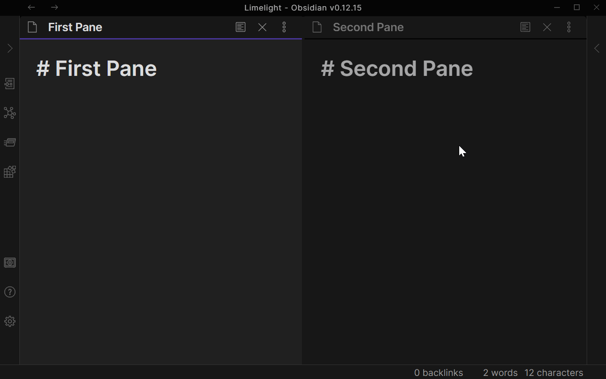

# Obsidian Limelight

This is a plugin for [Obsidian](https://obsidian.md) that spotlights your active pane to make it more obvious.

## Demo

## Installation

> This plugin is brand new and hasn't been accepted as a community plugin yet.  If you want to try it out, you can install it manually with the below steps (based on [this guide](https://forum.obsidian.md/t/plugins-mini-faq/7737)).  Once it is a community plugin this section will be updated with the normal installation steps.

1. Find the latest release on [this page](https://github.com/smikula/obsidian-limelight/releases).
2. Download `obsidian-limelight.zip` from that release.
3. In your vault, extract that zip file into `.obsidian/plugins/`.  (You may need to create the `plugins` directory if this is your first plugin.)
4. In Obsidian, go to Settings > Community plugins and enable "Limelight".  (You may need to disable safe mode first.)

## Contributing

If you run into problems, feel free to open an issue in this repository. In particular, if the plugin doesn't play well with some other plugin or theme, please let me know! Issues or pull requests are also welcome if you have ideas for improvements.
